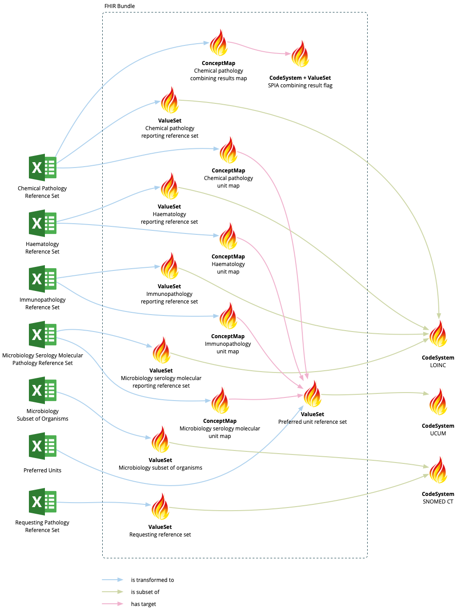

# SPIA to FHIR

A [Maven](https://maven.apache.org/) plugin for converting terminology from version 3.1 of the [Standards for Pathology Informatics in Australia (SPIA)](https://test.rcpa.edu.au/Library/Practising-Pathology/PTIS/APUTS-Downloads) into a set of [FHIR STU3](https://hl7.org/fhir/STU3/) terminology resources.

The input is the [ZIP archive](https://www.healthterminologies.gov.au/access?content=rcpadownload) distributed on the National Clinical Terminology Service web site.

The output is a FHIR [Bundle](https://hl7.org/fhir/STU3/bundle.html) containing the following resources:

1. Requesting reference set (SNOMED CT ValueSet)
2. Chemical pathology reporting reference set (LOINC ValueSet)
3. Chemical pathology unit map (ConceptMap)
4. Chemical pathology combining results flag map (ConceptMap)
5. Microbiology serology molecular reporting reference set (LOINC ValueSet)
6. Microbiology serology molecular unit map (ConceptMap)
7. Microbiology subset of organisms (SNOMED CT ValueSet)
8. Haematology reporting reference set (LOINC ValueSet)
9. Haematology unit map (ConceptMap)
10. Immunopathology reporting reference set (LOINC ValueSet)
11. Immunopathology unit map (ConceptMap)
12. Preferred unit reference set (UCUM ValueSet)
13. SPIA combining result flag (CodeSystem)



A FHIR terminology server that contains SNOMED CT and LOINC is required for the build process, as it is used to validate the content within the source files.

You can execute the plugin with the following commands:

```
mvn install

mvn -DinputPath=[zip file] \
    -DoutputPath=[bundle JSON file] \
    -DterminologyServerUrl=[FHIR terminology server endpoint] \
    -DpublicationDate=[publication date] \
    au.csiro:spia-to-fhir-maven-plugin:transform
```

Here is a description of the input parameters for the plugin:

* `inputPath`: Path to the ZIP archive used to distribute the SPIA spreadsheets.
* `outputPath`: Path where a FHIR Bundle will be created containing the transformed resources.
* `terminologyServerUrl`: Endpoint of a FHIR terminology server which contains SNOMED CT and LOINC.
* `publicationDate`: Date (in the format `yyyy-MM-dd`) used to populate the `ValueSet.date` and `ConceptMap.date` elements.
